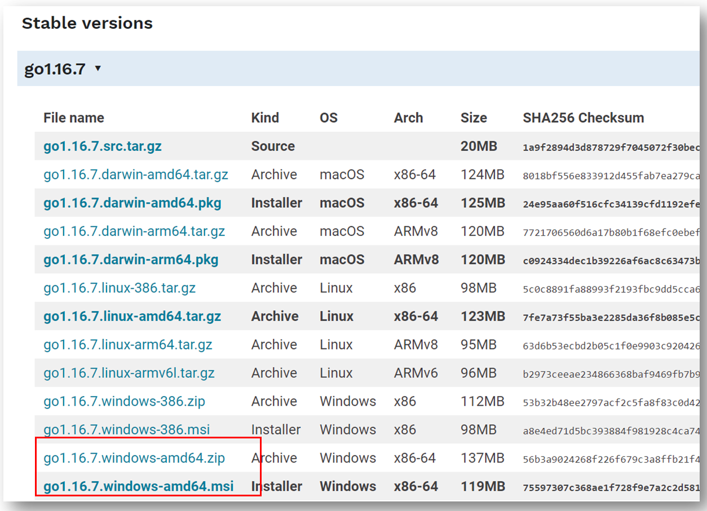
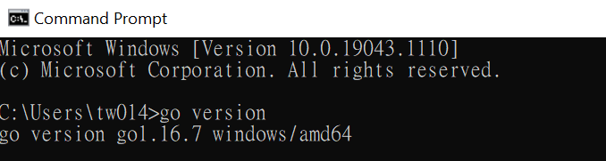
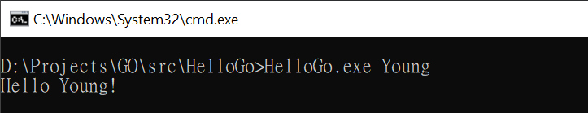

## Install Go in Windows
- Download [go1.16.7.windows-amd64.zip](https://golang.org/dl/go1.16.7.windows-amd64.zip) from [here](https://golang.org/dl/) and unzip.


- Use go command or setting environment variable on computer.
`go env -w GOROOT="D:\DevTools\Go-1.16.7"`
`go env -w GOPATH="D:\Projects\GO"`
or
`setx GOROOT "D:\DevTools\Go-1.16.7"`
`setx GOPATH "D:\Projects\GO"`
- Add `D:\DevTools\Go-1.16.7\bin` in windows path
- Use `go version` to check version on computer



## Start A Project
- `mkdir HelloGo` under `$GOPATH\src` and `cd HelloGo`
-  create file named `main.go`
-  paste code below in `main.go` 
```
package main  
  
import (  
   "fmt"  
 "os")  
func main(){  
   if len(os.Args) < 2 {  
      fmt.Printf("Usage: %s [Name]\n", os.Args[0])  
      os.Exit(2)  
   }  
   fmt.Printf("Hello %s!\n", os.Args[1])  
}
```
- In command line, use `go build -o HelloGo.exe main.go` to build golang.
- Enter `HelloGo.exe Young` to execute program.


## Reference
- [Golang website](https://golang.org/)
- [Golang image](https://hub.docker.com/_/golang?tab=description&page=1&ordering=last_updated&name=1.16.0)

###### Tags: `golang`